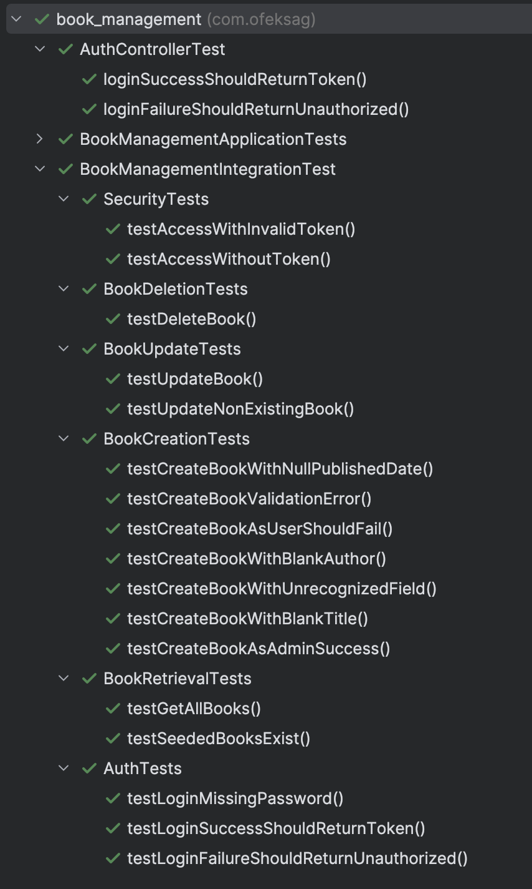

# Book Management System – RESTful API

This project is a backend RESTful API for managing a digital book library.  
It is built using **Java** and **Spring Boot**.

You can check out the project including Swagger UI —  
directly on my website:  
[https://ofeksagiv.com](https://ofeksagiv.com)

---

## Requirements

To run the project locally (without Docker), make sure you have:

- Java JDK 17 or higher
- Maven
- Git

You can verify the installations using:

```bash
java -version
mvn -version
git --version
```

## Setup Instructions

### 1. Clone the Repository

```bash
git clone https://github.com/OfekSagiv/book-management.git
cd book-management
```

### 2. Create `.env` file

Before running the application, you must generate a `.env` file containing a `SECRET_KEY`,  
which is required for signing JWT tokens in the authentication process.
You can do this in one of the following two ways:

#### Option 1: Via Terminal

```bash
mvn clean compile && mvn exec:java -Dexec.mainClass="com.ofeksag.book_management.utils.EnvFileGenerator"
```

#### Option 2: Via IDE

- Open the `EnvFileGenerator` class located at:  
  `src/main/java/com/ofeksag/book_management/utils/EnvFileGenerator.java`
- Run the `main()` method from your IDE 

### 3. Run the Application

```bash
mvn spring-boot:run
```

The server will start at:  
[http://localhost:8080](http://localhost:8080)


### 4. API Documentation – Swagger

Once the server is running, you can explore and test the API via Swagger UI at:

[http://localhost:8080/swagger-ui/index.html](http://localhost:8080/swagger-ui/index.html)

#### Authentication

To access secured endpoints, you must first authenticate using the `/auth/login` endpoint in Swagger.

Use one of the predefined users:

- **Admin user**  
  `username`: `admin`  
  `password`: `pass`

- **Regular user**  
  `username`: `user`  
  `password`: `pass`

After logging in, you will receive a **JWT token**.

> **Note:**  
> You do **not** need to add the prefix `Bearer` manually.  
> Just paste the token into the Swagger "Authorize" modal – it will be added automatically.

#### Sample Data

To make it easier to explore the system, the application starts with:

- `10` preloaded books
- `2` predefined users (admin and regular user)

### 5. Testing

The project includes comprehensive integration tests divided into several categories.
Below is an overview of the tests for each category:

<br/>

To run all tests, execute:

```bash
mvn test
```


## Docker

You can run the application with Docker in two ways:  
Either by building it locally with Docker Compose, or by pulling a prebuilt image.

---

### Option 1: Build Locally with Docker Compose

> Requires cloning the project and Docker installed.

```bash
git clone https://github.com/OfekSagiv/book-management.git
cd book-management
docker compose build
docker compose up -d
```

---

### Option 2: Use Prebuilt Image (No Cloning Required)

> No need to download the project — just pull and run the image.

```bash
docker run -d -p 8080:8080 -v h2-data:/app/data ofeksag/book-management-spring:v1.1
```